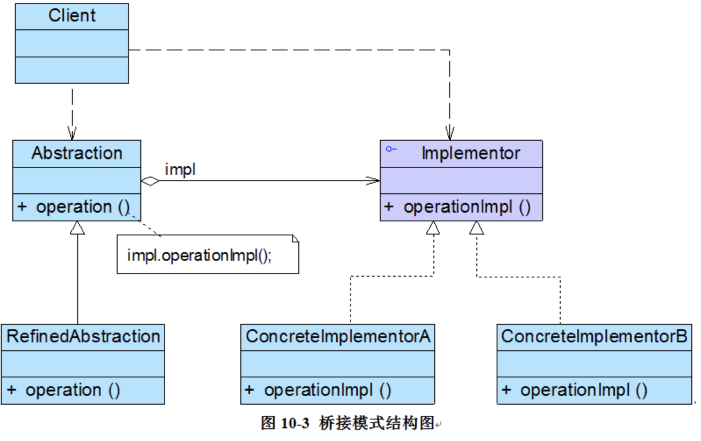

#### 桥梁模式

四、 模式优缺点
优点
1、分离抽象接口及其实现部分。提高了比继承更好的解决方案。
2、桥接模式提高了系统的可扩充性，在两个变化维度中任意扩展一个维度，都不需要修改原有系统。
3、实现细节对客户透明，可以对用户隐藏实现细节。
缺点
1、桥接模式的引入会增加系统的理解与设计难度，由于聚合关联关系建立在抽象层，要求开发者针对抽象进行设计与编程。 
2、桥接模式要求正确识别出系统中两个独立变化的维度，因此其使用范围具有一定的局限性。
五、 模式使用场景
1、如果一个系统需要在构件的抽象化角色和具体化角色之间增加更多的灵活性，避免在两个层次之间建立静态的继承联系，通过桥接模式可以使它们在抽象层建立一个关联关系。
2、对于那些不希望使用继承或因为多层次继承导致系统类的个数急剧增加的系统，桥接模式尤为适用。
3、一个类存在两个独立变化的维度，且这两个维度都需要进行扩展。
六、 模式总结
1、桥接模式实现了抽象化与实现化的脱耦。他们两个互相独立，不会影响到对方。
2、对于两个独立变化的维度，使用桥接模式再适合不过了。
3、对于“具体的抽象类”所做的改变，是不会影响到客户。