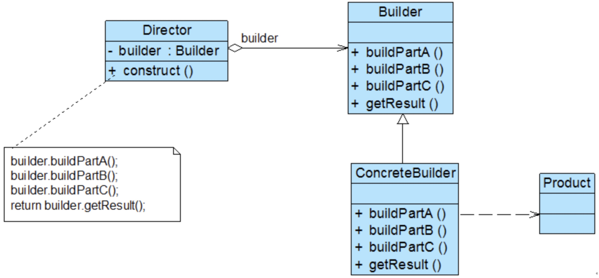

#### Builder

```
四、模式优缺点
优点
1、将复杂产品的创建步骤分解在不同的方法中，使得创建过程更加清晰，使得我们能够更加精确的控制复杂对象的产生过程。
2、将产品的创建过程与产品本身分离开来，可以使用相同的创建过程来得到不同的产品。也就说细节依赖抽象。
3、每一个具体建造者都相对独立，而与其他的具体建造者无关，因此可以很方便地替换具体建造者或增加新的具体建造者，用户使用不同的具体建造者即可得到不同的产品对象。
缺点
1、建造者模式所创建的产品一般具有较多的共同点，其组成部分相似，如果产品之间的差异性很大，则不适合使用建造者模式，因此其使用范围受到一定的限制。 
2、如果产品的内部变化复杂，可能会导致需要定义很多具体建造者类来实现这种变化，导致系统变得很庞大。
五、模式适用场景
1、需要生成的产品对象有复杂的内部结构，这些产品对象通常包含多个成员属性。 
2、隔离复杂对象的创建和使用，并使得相同的创建过程可以创建不同的产品。
六、模式总结
1、建造者模式是将一个复杂对象的创建过程给封装起来，客户只需要知道可以利用对象名或者类型就能够得到一个完整的对象实例，而不需要关心对象的具体创建过程。
2、建造者模式将对象的创建过程与对象本身隔离开了，使得细节依赖于抽象，符合依赖倒置原则。可以使用相同的创建过程来创建不同的产品对象。
```