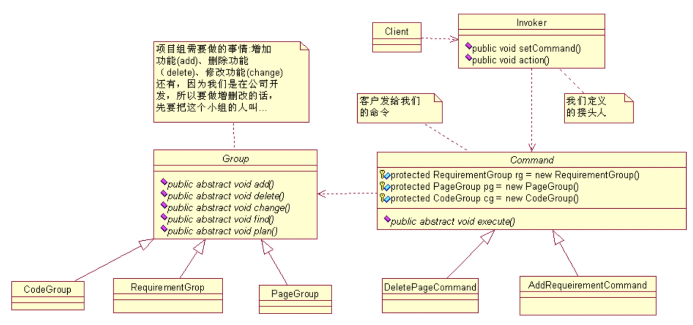

#### command模式

四、模式优缺点     
优点
降低了系统耦合度
新的命令可以很容易添加到系统中去。
缺点
使用命令模式可能会导致某些系统有过多的具体命令类。

五、模式使用场景      
1.系统需要将请求调用者和请求接收者解耦，使得调用者和接收者不直接交互。
2.系统需要在不同的时间指定请求、将请求排队和执行请求。
3.系统需要支持命令的撤销(Undo)操作和恢复(Redo)操作。
4.系统需要将一组操作组合在一起，即支持宏命令。
