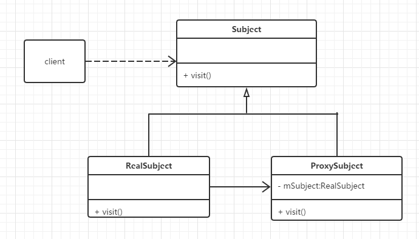

### 代理模式
代理模式类图

在代理模式中有如下三个角色：

Subject: 抽象角色。声明真实对象和代理对象的共同接口。 
Proxy: 代理角色。代理对象与真实对象实现相同的接口，所以它能够在任何时刻都能够代理真实对象。代理角色内部包含有对真实对象的引用，所以她可以操作真实对象，同时也可以附加其他的操作，相当于对真实对象进行封装。 
RealSubject: 真实角色。它代表着真实对象，是我们最终要引用的对象. 
四、 模式优缺点
#### 优点
1、 代理模式能够协调调用者和被调用者，在一定程度上降低了系统的耦合度。
2、 代理对象可以在客户端和目标对象之间起到中介的作用，这样起到了的作用和保护了目标对象的
#### 缺点
1、由于在客户端和真实主题之间增加了代理对象，因此有些类型的代理模式可能会造成请求的处理速度变慢。
2、 实现代理模式需要额外的工作，有些代理模式的实现非常复杂。

代理模式和策略模式代码侧面有点相似，仔细分析，其实策略模式的策略执行者可以不用执行策略的所有方法，但是代理人和被代理人必须实现同样的接口。
所以个人感觉策略模式比代理模式更有选择性。