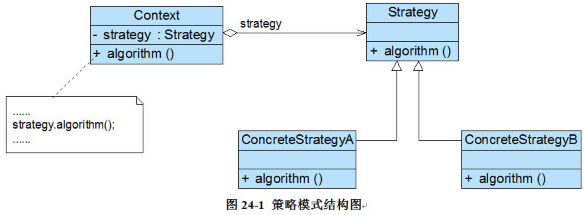

#### 策略设计模式
策略设计模式的定义： 
定义一系列算法类，将每一个算法封装起来，并让它们可以相互替换，策略模式让算法独立于使用它的客户而变化，也称为政策模式(Policy)。策略模式是一种对象行为型模式。

策略设计模式的角色： 
context(策略的执行者)：策略算法的调用实例。
strategy：策略算法的抽奖接口
concreteStrategyA(concreteStrategyB):策略算法实现类，可以扩展n个。
